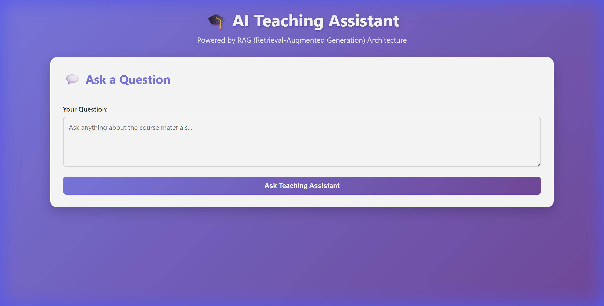

# 🎓 AI Teaching Assistant

A powerful **Retrieval-Augmented Generation (RAG)** system that acts as an intelligent teaching assistant. Built with **Ollama** for completely free, private, local AI inference - no API costs required!

[](https://github.com/Ratnesh-181998)
[](https://www.linkedin.com/in/ratneshkumar1998/)



## ✨ Features

- 🤖 **Local LLM Integration** - Uses Ollama (Mistral/Llama2) - completely free!
- 📚 **Multi-Source Learning** - Load from Wikipedia, PDFs, YouTube, and text files
- 🔍 **Smart Retrieval** - Vector-based similarity search with Chroma DB
- 💬 **Dual Interface** - Beautiful web UI + interactive CLI
- 🎨 **Modern Design** - Gradient UI with real-time chat
- 🔒 **100% Private** - All processing happens locally on your machine
- 💰 **Zero Cost** - No API fees, completely free to run

## 🏗️ Architecture

```
┌─────────────────┐
│ Document Loader │ ← Wikipedia, PDF, YouTube, Text
└────────┬────────┘
         ↓
┌─────────────────┐
│  Text Splitter  │ ← Chunk into 1000 chars (200 overlap)
└────────┬────────┘
         ↓
┌─────────────────┐
│ Ollama Embedder │ ← nomic-embed-text model
└────────┬────────┘
         ↓
┌─────────────────┐
│   Chroma DB     │ ← Vector storage & similarity search
└────────┬────────┘
         ↓
┌─────────────────┐
│   RAG Chain     │ ← Retrieve context + Generate answer
└────────┬────────┘
         ↓
┌─────────────────┐
│  Mistral LLM    │ ← Local response generation
└─────────────────┘
```

## 🚀 Quick Start

### Prerequisites

1. **Python 3.8+**
2. **Ollama** - [Download here](https://ollama.ai/download)

### Installation

```bash
# 1. Clone the repository
git clone https://github.com/Ratnesh-181998/AI-Teaching-Assistant.git
cd AI-Teaching-Assistant

# 2. Install Python dependencies
pip install -r requirements.txt

# 3. Install additional packages for Ollama version
pip install langchain-community sentence-transformers chromadb

# 4. Pull Ollama models
ollama pull mistral
ollama pull nomic-embed-text

# 5. Start Ollama server (keep this running)
ollama serve
```

### Run the Application

**Option 1: Web Interface** (Recommended)
```bash
# Windows
START_WEB_UI.bat

# Linux/Mac
python app_ollama.py
```
Then open http://localhost:5000

**Option 2: Command Line**
```bash
# Windows
START_ASSISTANT.bat

# Linux/Mac
python main_ollama.py
```

## 📖 Usage

### Load Course Materials

```python
from main_ollama import AITeachingAssistantOllama

ta = AITeachingAssistantOllama()

# Load from multiple sources
sources = {
    'wikipedia': ['Machine Learning', 'Deep Learning'],
    'pdf': ['./lectures/lecture1.pdf'],
    'youtube': ['https://www.youtube.com/watch?v=...'],
    'text': ['./notes.txt']
}

documents = ta.load_course_materials(sources)
ta.process_documents(documents)
ta.save_knowledge_base()
```

### Ask Questions

```python
# Initialize RAG
ta.initialize_rag()

# Ask a question
response = ta.ask("What is machine learning?")
print(response['answer'])
```

### Web API

```bash
# Start the server
python app_ollama.py

# Ask a question (POST request)
curl -X POST http://localhost:5000/api/ask \
  -H "Content-Type: application/json" \
  -d '{"question": "What is AI?"}'
```

## 📁 Project Structure

```
AI_Teaching_Assistant/
├── 📝 Core Application
│   ├── main_ollama.py          # CLI application
│   ├── app_ollama.py           # Web server (Flask)
│   └── config_ollama.py        # Configuration
│
├── 🔧 RAG Components
│   ├── document_loader.py      # Multi-source document loading
│   ├── text_splitter.py        # Text chunking
│   ├── vector_store_ollama.py  # Chroma vector database
│   └── rag_chain_ollama.py     # RAG pipeline
│
├── 🎨 User Interface
│   └── templates/
│       └── index.html          # Web UI
│
├── 🚀 Quick Launch
│   ├── START_WEB_UI.bat        # Launch web interface
│   └── START_ASSISTANT.bat     # Launch CLI
│
├── 📚 Documentation
│   ├── README.md               # This file
│   ├── FINAL_SUMMARY.md        # Complete guide
│   ├── OLLAMA_SETUP.md         # Ollama setup guide
│   └── QUICKSTART.md           # Quick start guide
│
└── ⚙️ Configuration
    ├── requirements.txt        # Python dependencies
    ├── .env.example           # Environment template
    └── .gitignore             # Git ignore rules
```

## 🎯 API Endpoints

### GET /api/health
Check server status and knowledge base availability.

### POST /api/ask
Ask a question to the teaching assistant.
```json
{
  "question": "What is machine learning?"
}
```

### POST /api/upload
Upload new course materials.
```json
{
  "sources": {
    "wikipedia": ["Topic 1", "Topic 2"],
    "pdf": ["path/to/file.pdf"]
  }
}
```

### POST /api/search
Perform similarity search in the knowledge base.
```json
{
  "query": "neural networks",
  "k": 4
}
```

## ⚙️ Configuration

Edit `config_ollama.py` to customize:

```python
# Model settings
LLM_MODEL = 'mistral'              # or 'llama2', 'tinyllama'
EMBEDDING_MODEL = 'nomic-embed-text'

# Text processing
CHUNK_SIZE = 1000                  # Characters per chunk
CHUNK_OVERLAP = 200                # Overlap between chunks

# Retrieval
TOP_K_RESULTS = 4                  # Number of context chunks

# Generation
TEMPERATURE = 0.7                  # LLM creativity (0-1)
```

## 🔄 Alternative: OpenAI Version

For faster responses (requires API key):

```bash
# 1. Add your OpenAI API key to .env
OPENAI_API_KEY=sk-...

# 2. Run the OpenAI version
python app.py
```

## 📊 Performance

| Mode | Speed | Cost | Privacy |
|------|-------|------|---------|
| **Ollama (CPU)** | 60-90s | Free | 100% Local |
| **Ollama (GPU)** | 3-5s | Free | 100% Local |
| **OpenAI API** | 1-2s | ~$0.001/q | Cloud |

## 🛠️ Troubleshooting

### Slow Responses
- **Normal for CPU**: 60-90 seconds is expected
- **Speed up**: Add GPU or use OpenAI API

### "Ollama not found"
```bash
# Check if Ollama is installed
ollama --version

# Start the server
ollama serve
```

### "No knowledge base"
```bash
# Create knowledge base
python main_ollama.py
# Follow prompts to load materials
```

## 🤝 Contributing

Contributions are welcome! Please feel free to submit a Pull Request.

1. Fork the repository
2. Create your feature branch (`git checkout -b feature/AmazingFeature`)
3. Commit your changes (`git commit -m 'Add some AmazingFeature'`)
4. Push to the branch (`git push origin feature/AmazingFeature`)
5. Open a Pull Request

## 📄 License

This project is licensed under the MIT License - see the [LICENSE](LICENSE) file for details.

## 🙏 Acknowledgments

- **Ollama** - For making local LLMs accessible
- **LangChain** - For the RAG framework
- **Chroma** - For vector database
- **Mistral AI** - For the Mistral LLM

## 📞 Support

- 💼 LinkedIn: [Ratnesh Kumar](https://www.linkedin.com/in/ratneshkumar1998/)
- 🐛 Issues: [GitHub Issues](https://github.com/Ratnesh-181998/AI-Teaching-Assistant/issues)
- 💬 Discussions: [GitHub Discussions](https://github.com/Ratnesh-181998/AI-Teaching-Assistant/discussions)

## 🌟 Star History

If you find this project useful, please consider giving it a ⭐!

---

**Built with ❤️ using Ollama, LangChain, and Chroma**  
**No OpenAI API required • Completely Free • 100% Private**
